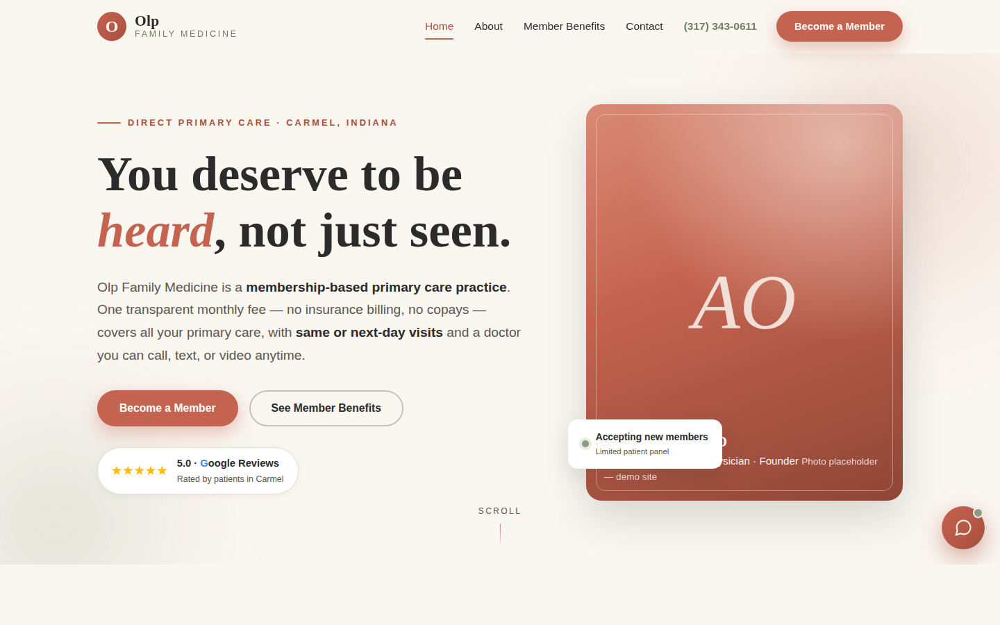

# Olp Family Medicine — Demo Website

### 🔗 View the live site: **[da.gd/OlpFamilyM](https://da.gd/OlpFamilyM)**

*(Direct link: [raw.githack.com/iga242006-cloud/Olp-Family-Medicine-/gh-pages/index.html](https://raw.githack.com/iga242006-cloud/Olp-Family-Medicine-/gh-pages/index.html))*



A multi-page static demo website for **Olp Family Medicine**, a Direct Primary Care practice in Carmel, Indiana. Built as a Pavlina demo to showcase all three Pavlina services:

1. **Website Optimization** — conversion-first layout, one primary CTA per page ("Become a Member"), sticky nav with persistent CTA, click-to-call on mobile, semantic HTML, per-page meta titles/descriptions, LocalBusiness/Physician JSON-LD, robots.txt + sitemap, smooth scroll animations, fully responsive. No frameworks, no build tools.
2. **Google Reviews** — homepage review section styled as Google review cards (labeled as sample content), aggregate ★ 5.0 badge in the hero, "Leave us a review" CTA block.
3. **ARIA (AI receptionist)** — floating chat widget on every page with scripted keyword-matched answers (membership cost, what's included, insurance, how DPC works, joining, hours/location, weight loss, hormone therapy), quick-reply chips, and a lead-capture fallback. Pure vanilla JS, no API.

## Pages

| Page | Contents |
|---|---|
| `index.html` | Full-viewport hero, membership value props, transparent pricing, weight loss + hormone highlights, Google reviews, join CTA |
| `about.html` | Dr. Ashlie Olp's founding story (patient-turned-advocate, Carmel Marathon champion), team bios for Molly (NP) and Candi (MA) |
| `benefits.html` | What membership includes, DPC explained in 3 steps, add-on services, FAQ |
| `contact.html` | Address, phone, email, hours, demo contact form, map placeholder |

## Structure

```
olp-demo/
├── index.html
├── about.html
├── benefits.html
├── contact.html
├── robots.txt / sitemap.xml
├── css/styles.css
└── js/
    ├── main.js     # nav, scroll reveal, demo form
    └── aria.js     # ARIA chat widget (self-injecting)
```

## How it deploys

Every push to this branch runs the **Deploy to GitHub Pages** workflow, which publishes `olp-demo/` to the [`gh-pages`](../../tree/gh-pages) branch. The live link above serves directly from that branch — changes go live automatically, nothing to configure.

Alternative deploys: drag the `olp-demo` folder onto [Netlify Drop](https://app.netlify.com/drop), or enable GitHub Pages in **Settings → Pages → Deploy from a branch → `gh-pages`** to also serve at `iga242006-cloud.github.io/Olp-Family-Medicine-`.

## Notes

- Demo pricing and reviews are illustrative and labeled as such on the site.
- The contact form and review button are intentionally non-functional (demo).
- Photos are CSS gradient placeholders — swap in real imagery for production.
- Design: terracotta / cream / charcoal / sage palette, Cormorant Garamond + Inter type.

---

*Website concept by Pavlina · Demo site — not the practice's official website*
